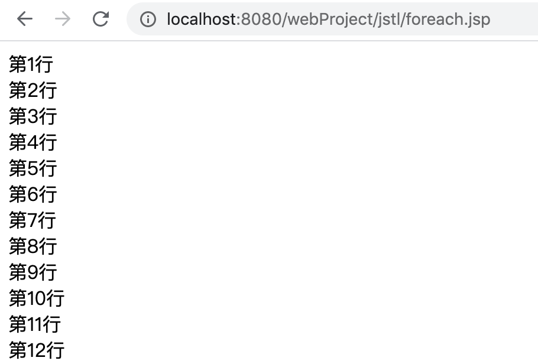

# jsp和Spring入门

## 1.jsp标签

restful指的是除了get post请求，如put del 请求

jsp的本质是java/html/web的混合

思路 （servlet处理->jsp处理）

#### 1.servlet处理

```java
	protected void doGet(HttpServletRequest request, HttpServletResponse response) throws ServletException, IOException {
//		response.getWriter().append("Served at: ").append(request.getContextPath());
		request.setAttribute("flag", true);
		request.setAttribute("name", "wlx");
        // 跳转到 message.jsp
        getServletContext().getRequestDispatcher("/jstl/flag.jsp").forward(
                request, response);
		//response.getWriter().append("doGET Method successful");

	}
```

#### 2.jsp处理

```jsp
<%@ page language="java" contentType="text/html; charset=UTF-8"
    pageEncoding="UTF-8"%>
<!DOCTYPE html>
<%
Boolean flag=(Boolean)request.getAttribute("flag");
String name =(String)request.getAttribute("name");
%>
<html>
<head>
<meta charset="UTF-8">
<title>Insert title here</title>
</head>
<body>
<%
	if(flag){
%>
<h2>欢迎<%=name %></h2>
<%}
%>
</body>
</html>
```

#### 3.获取前端传参数

```java
		String type=request.getParameter("type");
```

实例

```java
protected void doGet(HttpServletRequest request, HttpServletResponse response) throws ServletException, IOException {
		// TODO Auto-generated method stub
//		response.getWriter().append("Served at: ").append(request.getContextPath());
		String type=request.getParameter("type");
		String page="/jstl/flag.jsp";
		if("1".equals(type)) {
		request.setAttribute("flag", true);
		request.setAttribute("name", "wlx");
		}else if("2".equals(type)){
			request.setAttribute("Age",18);
			page="/jstl/test2.jsp";
		}else if("3".equals(type)) {
			request.setAttribute("Sex", "man");
			page="/jstl/test3.jsp";
		}
        // 跳转到 message.jsp
        getServletContext().getRequestDispatcher(page).forward(
                request, response);
		//response.getWriter().append("doGET Method successful");

	}
```

访问路径：http://localhost:8080/webProject/Test?type=1

### 2.jstl

因为在jsp中写代码有时候过于复杂，所以为了优化jsp，产生了jstl

#### 2.1引用核心标签库

```jsp
<%@ taglib prefix=*"c"* uri=*"http://java.sun.com/jsp/jstl/core"* %>
```

会报错引包即可

```xml
<!-- https://mvnrepository.com/artifact/javax.servlet/jstl -->
<dependency>
    <groupId>javax.servlet</groupId>
    <artifactId>jstl</artifactId>
    <version>1.2</version>
</dependency>
```

#### 2.2语言书写

```jsp
<%@ page language="java" contentType="text/html; charset=UTF-8"
    pageEncoding="UTF-8"%>
<%@ taglib prefix="c" uri="http://java.sun.com/jsp/jstl/core" %>
<!DOCTYPE html>
<%
Boolean flag=(Boolean)request.getAttribute("flag");
String name =(String)request.getAttribute("name");
%>
<html>
<head>
<meta charset="UTF-8">
<title>Insert title here</title>
</head>
<body>
<!-- jstl语法 -->
<c:if test="${flag==true}">
欢迎来到JSTL类库<h2>${name}</h2>
</c:if>
<!-- jstl语法 -->
</body>
</html>
```

#### 2.3jstl支持表达式语言

```jsp
<%@ page language="java" contentType="text/html; charset=UTF-8"
    pageEncoding="UTF-8"%>
<%@ taglib prefix="c" uri="http://java.sun.com/jsp/jstl/core" %>
<!DOCTYPE html>
<%
Boolean flag=(Boolean)request.getAttribute("flag");
String name =(String)request.getAttribute("name");
String age =(String)request.getAttribute("age");
%>
<html>
<head>
<meta charset="UTF-8">
<title>Insert title here</title>
</head>
<body>
<c:choose>
<!-- 这里必须是<c:when test=" “的标准写法 -->
<c:when test="${age<12}">小学生哦</c:when>
<c:when test="${age>=12&&age<18}">你成长为一个中学生了</c:when>
<c:when test="${age>=18&&age<30}">你是祖国的栋梁了</c:when>
<c:when test="${age>30}">你已经是一个成年人了</c:when>
</c:choose>
</body>
</html>
```

#### 2.4支持循环

```jsp
<%@ page language="java" contentType="text/html; charset=UTF-8"
    pageEncoding="UTF-8"%>
<%@ taglib prefix="c" uri="http://java.sun.com/jsp/jstl/core" %>
<!DOCTYPE html>
<%
Boolean flag=(Boolean)request.getAttribute("flag");
String name =(String)request.getAttribute("name");
%>
<html>
<head>
<meta charset="UTF-8">
<title>for循环实例</title>
</head>
<body>
<c:forEach var="i" begin="1" end="100" step="1">
第<c:out value="${i}"></c:out>行
<br>
</c:forEach>
</body>
</html>
```

效果：

