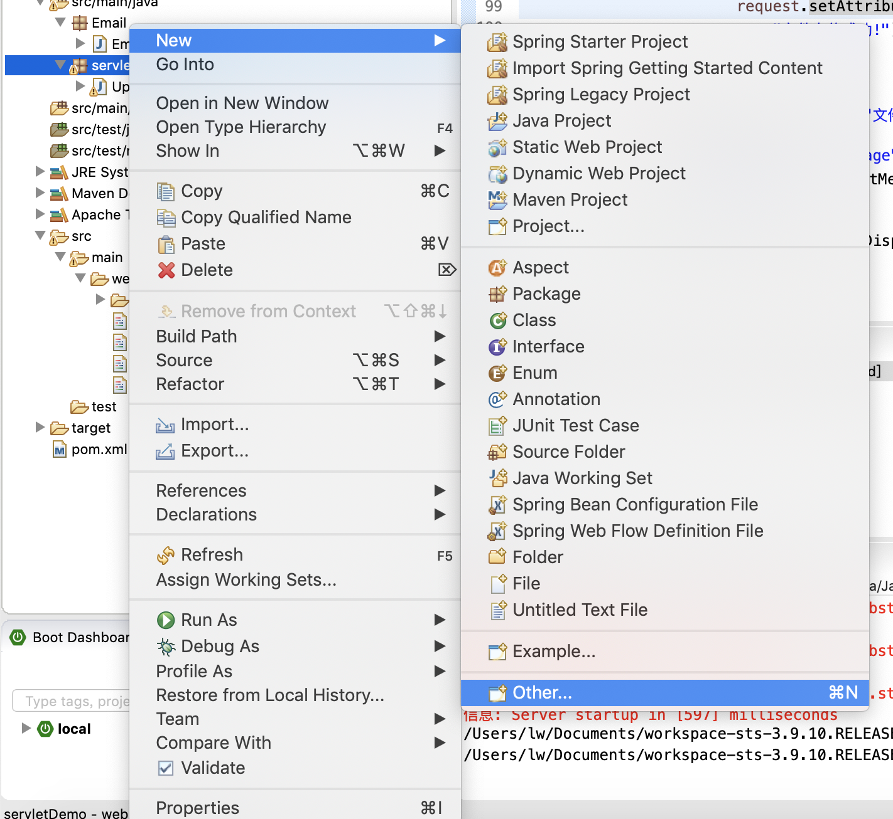
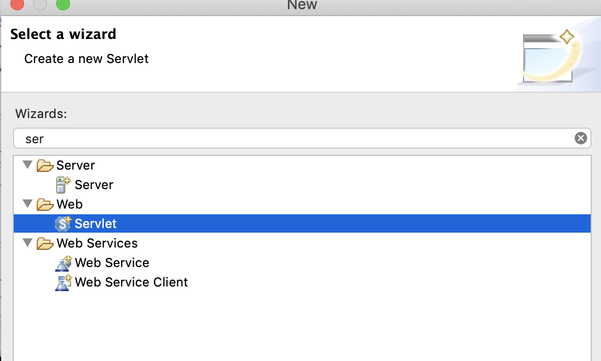
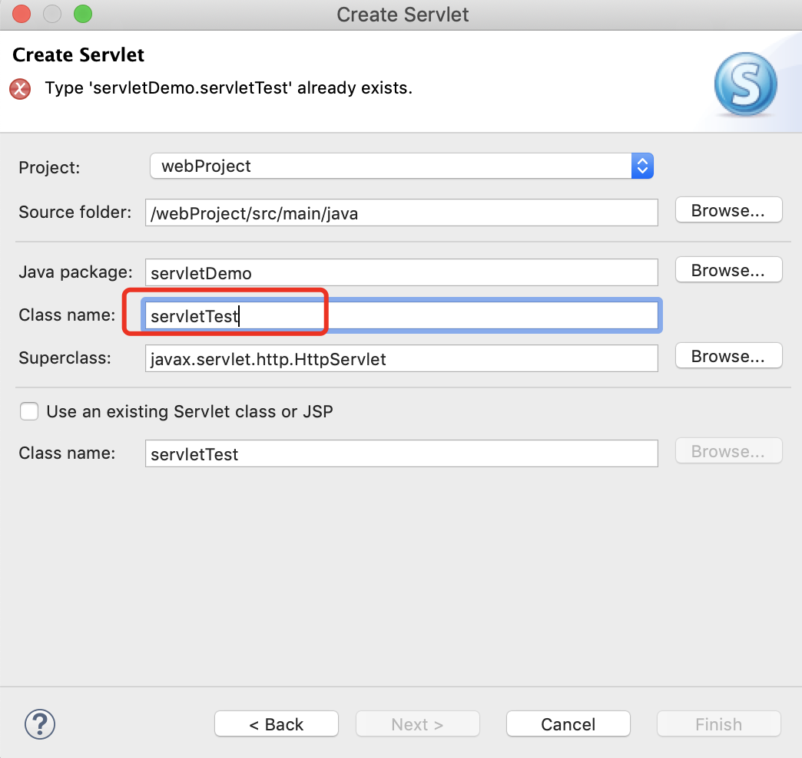
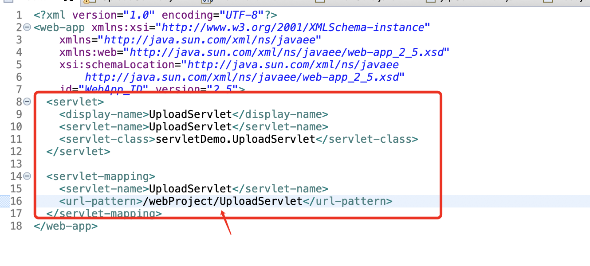
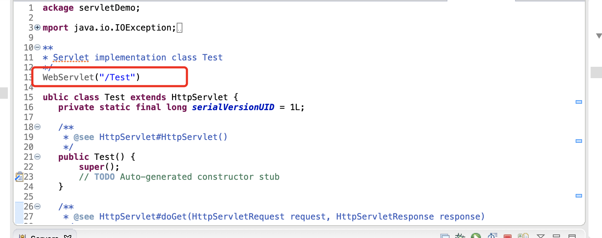
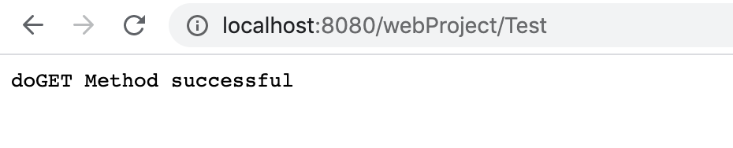
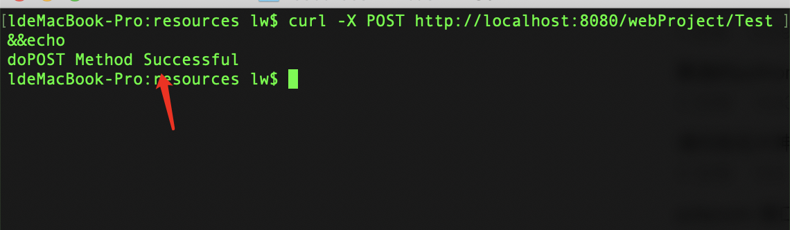

### 11.jsp文件上传

#### 1.搭建jsp环境

https://www.runoob.com/jsp/jsp-file-uploading.html

#### 2.例子优化

jsp中获取当前项目的名称

```jsp
<%= this.getServletContext().getContextPath() %>
```

#### 3.如何修改支持传多个文件

因为后端是支持多个文件上传的，所以我们只需要修改前端页面即可

```java
                // 迭代表单数据
                for (FileItem item : formItems) {
                    // 处理不在表单中的字段
                    if (!item.isFormField()) {
                        String fileName = new File(item.getName()).getName();
                        String filePath = uploadPath + File.separator + fileName;
                        File storeFile = new File(filePath);
                        // 在控制台输出文件的上传路径
                        System.out.println(filePath);
                        // 保存文件到硬盘
                        item.write(storeFile);
                        request.setAttribute("message",
                            "文件上传成功!");
                    }
```

修改前端jsp页面

原：

```jsp
<%@ page language="java" contentType="text/html; charset=UTF-8"
    pageEncoding="UTF-8"%>
<!DOCTYPE html PUBLIC "-//W3C//DTD HTML 4.01 Transitional//EN"
    "http://www.w3.org/TR/html4/loose.dtd">
<html>
<head>
<meta http-equiv="Content-Type" content="text/html; charset=UTF-8">
<title>文这里是文件上传实例的标题</title>
</head>
<body>
<h1>文件上传实例</h1>
<form method="post" action="/TomcatTest/UploadServlet" enctype="multipart/form-data">
    选择一个文件:
    <input type="file" name="uploadFile" />
    <br/><br/>
    <input type="submit" value="上传" />
</form>
</body>
</html>
```


```jsp
<%@ page language="java" contentType="text/html; charset=UTF-8"
    pageEncoding="UTF-8"%>
<!DOCTYPE html PUBLIC "-//W3C//DTD HTML 4.01 Transitional//EN"
    "http://www.w3.org/TR/html4/loose.dtd">
<html>
<head>
<meta http-equiv="Content-Type" content="text/html; charset=UTF-8">
<title>这里是文件上传实例的标题</title>
</head>
<body>
<h1>文件上传实例</h1>
<!-- <%= this.getServletContext().getContextPath() %> -->
<form method="post" action=" <%= this.getServletContext().getContextPath() %>/UploadServlet" enctype="multipart/form-data">
    文件1:
    <input type="file" name="uploadFile" /><br/><br/>
    文件2:
    <input type="file" name="uploadFile" /><br/><br/>
    <br/><br/>
    <input type="submit" value="上传" />
</form>
</body>
</html>
```

#### 4.同一个文件名会覆盖？

1.增加时间戳的方式去保存文件

```java
                    if (!item.isFormField()) {
                        String fileName = new File(item.getName()).getName();
                        String filePath = uploadPath + File.separator + DateFormatUtils.format(new Date(),"yyyyMMddHHmmss")+fileName;
                        File storeFile = new File(filePath);
                        // 在控制台输出文件的上传路径
                        System.out.println(filePath);
                        // 保存文件到硬盘
                        item.write(storeFile);
                        request.setAttribute("message",
                            "文件上传成功!");
                    }
```

### 12.jsp文件上传和邮件结合

1.首先需要改造EmailUtils使可以接收一个List

```java
  public static void sendMail(String Subject,List<String> filenameList) throws Exception{
	        String[] toList={"675180802@qq.com"};
	        // Create the email message
	        MultiPartEmail email = new MultiPartEmail();
	        email.setHostName("smtp.163.com");//邮件服务器域名
	        email.setAuthentication("zrmxweiliangxiang@163.com","QCYYMATWVTPXEUUE");//认证账户
	        email.setCharset("UTF-8");
	        email.setSubject(Subject);
	        email.setFrom("zrmxweiliangxiang@163.com");
	        for (String to:toList){
	            email.addTo(to);
	        }
	        // add the attachment
	        for(int i=0;i<filenameList.size();i++) {
	            // Create the attachment
		        EmailAttachment attachment = new EmailAttachment();
		        attachment.setDisposition(EmailAttachment.ATTACHMENT);
		        attachment.setDescription("代发测试");
		    	String[] pathList =filenameList.get(i).split("/");
	        	attachment.setName(pathList[pathList.length-1]);
		        attachment.setPath(filenameList.get(i));
		        email.attach(attachment);
	        }

	    
	        email.send();
}
```

2.servlet改造则比较简单，再最后加上即可

   Email.EmailUtils.sendMail("文件上传Servlet", stringFileList);

```java
package servletDemo;

import java.io.File;
import java.io.IOException;
import java.io.PrintWriter;
import java.util.ArrayList;
import java.util.Date;
import java.util.List;
 
import javax.servlet.ServletException;
import javax.servlet.annotation.WebServlet;
import javax.servlet.http.HttpServlet;
import javax.servlet.http.HttpServletRequest;
import javax.servlet.http.HttpServletResponse;
 
import org.apache.commons.fileupload.FileItem;
import org.apache.commons.fileupload.disk.DiskFileItemFactory;
import org.apache.commons.fileupload.servlet.ServletFileUpload;
import org.apache.commons.lang3.time.DateFormatUtils;
import org.apache.commons.lang3.time.DateUtils;
 

/**
 * Servlet implementation class UploadServlet
 */
@WebServlet("/UploadServlet")
public class UploadServlet extends HttpServlet {
    private static final long serialVersionUID = 1L;
     
    // 上传文件存储目录
    private static final String UPLOAD_DIRECTORY = "upload";
 
    // 上传配置
    private static final int MEMORY_THRESHOLD   = 1024 * 1024 * 3;  // 3MB
    private static final int MAX_FILE_SIZE      = 1024 * 1024 * 40; // 40MB
    private static final int MAX_REQUEST_SIZE   = 1024 * 1024 * 50; // 50MB
 
    /**
     * 上传数据及保存文件
     */
    protected void doPost(HttpServletRequest request,
        HttpServletResponse response) throws ServletException, IOException {
        // 检测是否为多媒体上传
        if (!ServletFileUpload.isMultipartContent(request)) {
            // 如果不是则停止
            PrintWriter writer = response.getWriter();
            writer.println("Error: 表单必须包含 enctype=multipart/form-data");
            writer.flush();
            return;
        }
 
        // 配置上传参数
        DiskFileItemFactory factory = new DiskFileItemFactory();
        // 设置内存临界值 - 超过后将产生临时文件并存储于临时目录中
        factory.setSizeThreshold(MEMORY_THRESHOLD);
        // 设置临时存储目录
        factory.setRepository(new File(System.getProperty("java.io.tmpdir")));
 
        ServletFileUpload upload = new ServletFileUpload(factory);
         
        // 设置最大文件上传值
        upload.setFileSizeMax(MAX_FILE_SIZE);
         
        // 设置最大请求值 (包含文件和表单数据)
        upload.setSizeMax(MAX_REQUEST_SIZE);
        
        // 中文处理
        upload.setHeaderEncoding("UTF-8"); 

        // 构造临时路径来存储上传的文件
        // 这个路径相对当前应用的目录
        String uploadPath = getServletContext().getRealPath("/") + File.separator + UPLOAD_DIRECTORY;
       
         
        // 如果目录不存在则创建
        File uploadDir = new File(uploadPath);
        if (!uploadDir.exists()) {
            uploadDir.mkdir();
        }
 
        try {
            // 解析请求的内容提取文件数据
            @SuppressWarnings("unchecked")
            List<FileItem> formItems = upload.parseRequest(request);
            List<String> stringFileList = new ArrayList<String>();
            if (formItems != null && formItems.size() > 0) {
                // 迭代表单数据
                for (FileItem item : formItems) {
                    // 处理不在表单中的字段
                    if (!item.isFormField()) {
                        String fileName = new File(item.getName()).getName();
                        String filePath = uploadPath + File.separator + DateFormatUtils.format(new Date(),"yyyyMMddHHmmss")+fileName;
                        File storeFile = new File(filePath);
                        stringFileList.add(filePath);
                        // 在控制台输出文件的上传路径
                        System.out.println(filePath);
                        // 保存文件到硬盘
                        item.write(storeFile);
                        request.setAttribute("message",
                            "文件上传成功!");
                    }
                }
            }
            Email.EmailUtils.sendMail("文件上传Servlet", stringFileList);
        } catch (Exception ex) {
            request.setAttribute("message",
                    "错误信息: " + ex.getMessage());
        }
        // 跳转到 message.jsp
        getServletContext().getRequestDispatcher("/message.jsp").forward(
                request, response);
    }
}
```

### 13.servlet详解

mvc模型的初步阶段

jsp：只管视图view

servlet：后台控制

mode：数据传递对象

通过servlet构建一个简单的GET和POST方法

#### 1.新建一个servlet



#### 2.选择servlet



3.填写setvelet的classname，后续下一步下一步即可



#### 3.修改返回值

```java
	protected void doGet(HttpServletRequest request, HttpServletResponse response) throws ServletException, IOException {
		// TODO Auto-generated method stub
//		response.getWriter().append("Served at: ").append(request.getContextPath());
		response.getWriter().append("doGET Method successful");

	}

	/**
	 * @see HttpServlet#doPost(HttpServletRequest request, HttpServletResponse response)
	 */
	protected void doPost(HttpServletRequest request, HttpServletResponse response) throws ServletException, IOException {
		// TODO Auto-generated method stub
		response.getWriter().append("doPOST Method Successful");
	}
```

访问的不同方式：

1.可以从we b.xml配置访问



2.也可以使用servlet的标签访问



#### 4.验证启动Tomcat访问url





